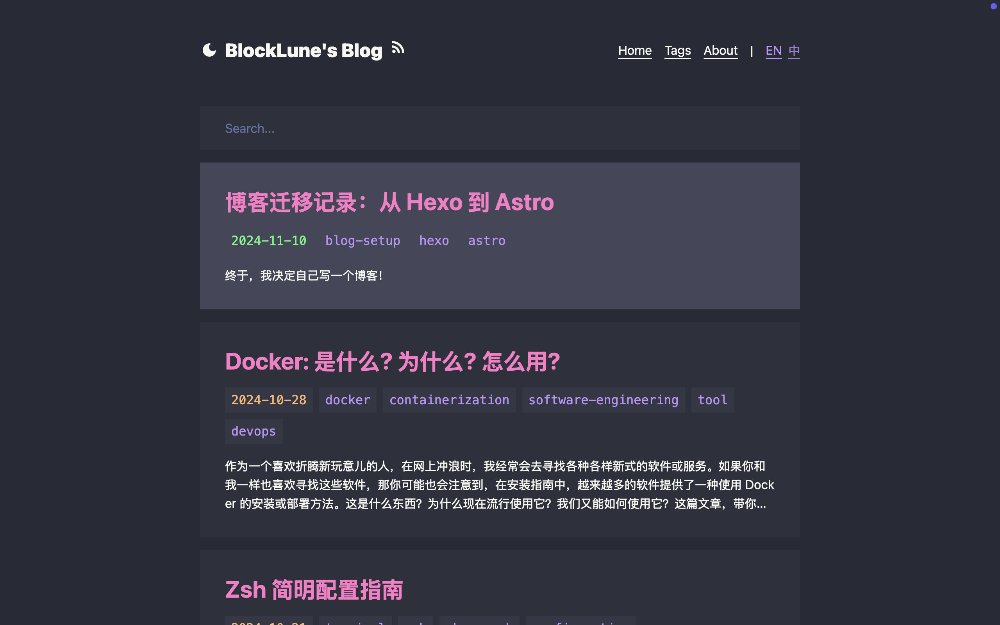

# Astro Dracula Blog



## :fire: Features

- [x] :rocket: Fast & High Performance
- [x] :star: Simple & Clean Design
- [x] :iphone: Responsive Design
- [x] :vampire_man: Dracula Theme
- [x] :zap: Animations created with [Motion](motion.dev) (the original Framer Motion)
- [x] :mag: Fuzzy Search built with [fuse.js](https://www.fusejs.io/)
- [x] :world_map: Sitemap & RSS Feed
- [x] :spider_web: SEO-Friendly
- [x] :earth_asia: I18n-Supported (`zh` & `en`)
- [x] :triangular_ruler: Mathjax Supported
- [x] :octocat: [GitHub Alerts](https://github.com/chrisweb/rehype-github-alerts)
- [x] :book: TOC

## :white_check_mark: Lighthouse Score

<p aligh="center">
    <a href="https://pagespeed.web.dev/analysis/https-blocklune-cc/72o0c25cxa?form_factor=desktop">
        
    </a>
</p>

## :rocket: How To Use

File structure:

```text
.
├── astro.config.mjs
├── package.json
├── public/
├── src/
│   ├── assets/
│   │   └── avatar.webp
│   ├── components/
│   ├── config.ts
│   ├── content/
│   │   ├── config.ts
│   │   ├── drafts/
│   │   │   └── ...
│   │   ├── info/
│   │   │   ├── en/
│   │   │   │   └── about.md
│   │   │   └── zh/
│   │   │       └── about.md
│   │   └── posts/
│   │       ├── en/
│   │       │   └── example-post.md
│   │       └── zh/
│   │           └── example-post.md
│   ├── middleware.ts
│   ├── pages/
│   ├── schemas/
│   ├── styles/
│   └── utils/
├── tailwind.config.mjs
└── tsconfig.json
```

To use this theme, follow these steps:

1. Edit `src/config.ts` to configure the basic information for your site. You can also configure your [umami](https://umami.is/) analytics and search engine verifications here.
2. Replace `src/assets/avatar.webp` with your own avatar.
3. Rewrite your own about page text in `src/content/info/en/about.md` & `src/info/zh/about.md`.
4. Delete my posts in `src/content/posts` and write your own. Currently the theme supports both Chinese and English languages, for different language versions of the same post, you need to make sure they are located in the `en` and `zh` directories and use the same filename.

To start writing a new post, follow these steps:

1. Create a file in `src/content/posts/en` if you are writing the English version of a post, say `hello-world.md`.
2. Edit the file `src/content/posts/en/hello-world.md` like this:

```text
---
title: Hello World
tags:
- hello
- my-first-post
date: 2024-11-12 18:50:00
---

Hello! This is my first post!

<!--more-->

I'm writing my first post!
```

To customize the color scheme of this theme, edit the following files:

- `src/components/prose.astro`
- `src/styles/global.css`
- `src/styles/rehype-github-alerts.css`
- `tailwind.config.mjs`

Currently this theme supports both Chinese and English, and uses English as its default language. To switch it to Chinese, edit `src/utils/i18n.ts`:

```ts
export const defaultLang : Lang = "zh";
```

Useful commands:

```bash
# install dependencies
pnpm install

# start the dev server
pnpm dev

# build the project
pnpm build

# preview (after the build)
pnpm preview
```

## :books: The Story

This is my fourth attempt at building a blog system. My journey began at the tender age of 14, when I first dabbled in creating a blog. I learned the basics of HTML in a junior high computer class, and furthered my knowledge through resources such as [doyoudo](https://www.bilibili.com/video/BV1gp411f7j6). My first attempt at blogging was a simple static site created with HTML & CSS, no JavaScript, and hosted on GitHub Pages.

As I approached college, I experimented with [Hexo](https://hexo.io/) and the [Icarus](https://ppoffice.github.io/hexo-theme-icarus/) theme for my second blog. For the third iteration, I continued using Hexo, but this time with the [NexT](https://theme-next.js.org/) theme. Using a framework like Hexo greatly streamlines the blogging process, allowing me to focus on content creation. However, I have always felt the "weight" of using a framework.

Determined to create a blog that was truly my own, I decided to build one from the ground up. And here it is!

The blog is mainly built with [Astro](https://astro.build/) with [React](https://react.dev/) components. I chose Astro because it is super fast. The color scheme is inspired by [Dracula](https://draculatheme.com/). I use [Tailwind CSS](https://tailwindcss.com/) for styling and [Tailwind Typography](https://github.com/tailwindlabs/tailwindcss-typography) for typography. And I do some animations with [Motion](https://motion.dev)(the original Framer Motion).

## :link: References

- [Dracula Theme](https://draculatheme.com/contribute)
- [overreacted.io - Dan's blog](https://overreacted.io/)
- [bearblog.dev](https://bearblog.dev/)
- [Astro Docs](https://docs.astro.build/)
