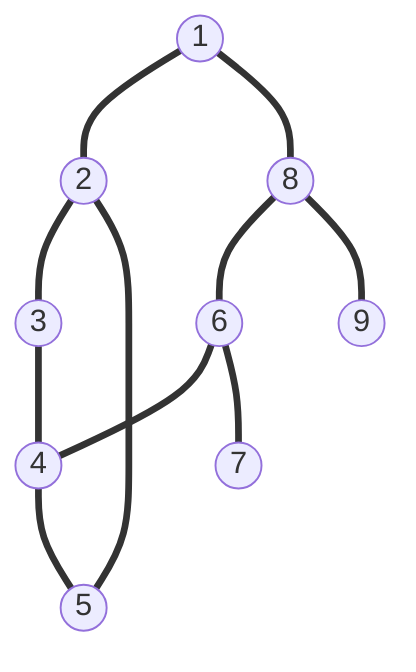
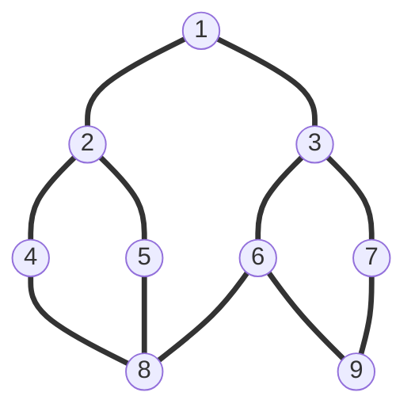

**深度优先搜索**（DFS，Depth First Search）和**广度优先搜索**（BFS，Breadth First Search），我从来没弄明白过。是时候努力去好好理解一下了。

<!--more-->

B 站找了两个视频看，这篇文章是笔记。

~~所以图直观还是直接看视频吧...~~

- [《不怕你学不会系列：深度优先搜索\_哔哩哔哩\_bilibili》](https://www.bilibili.com/video/BV1cQ4y127Kd/)
- [《不怕你学不会系列：宽度优先搜索\_哔哩哔哩\_bilibili》](https://www.bilibili.com/video/BV1H44y1871A/)

## 深度优先搜索

DFS 的搜索过程要结合 **栈** 来理解，实际上这个过程就是在对一个 **栈** 在操作。比如我们有这样一张图：

我们建立一个栈，然后开始遍历上边这张图。我们做以下约定：

- 已经入栈的节点要被标记为已经遍历；
- 起始节点为 1，将其入栈，作为最初的栈顶；
- 查看与当前栈顶元素相连并且未被标记的节点，将其入栈；
- 如果有多个满足 3 中条件的元素，节点序号较小的优先入栈；
- 当栈顶元素没有相连节点或所有相连节点均已经被标记后，将其出栈。

所以对于上边的图，我们依次进行下面的操作：

1. 节点 1 入栈，并将其标记；
2. 查找与当前栈顶元素节点 1 相连并且没有标记的元素，有节点 2 和节点 8，节点 2 优先入栈，将节点 2 标记；
3. 查找与当前栈顶元素节点 2 相连并且没有标记的元素，有节点 3 和节点 5，节点 3 优先入栈，将节点 3 标记；
4. 查找与当前栈顶元素节点 3 相连并且没有标记的元素，只有节点 4，节点 4 入栈，并将其标记；
5. 查找与当前栈顶元素节点 4 相连并且没有标记的元素，有节点 5 和 节点 6 ，节点 5 优先入栈，将节点 5 标记；
6. 查找与当前栈顶元素节点 5 相连的元素，有节点 2 和节点 4，但均已被标记，所以当前栈顶节点 5 出栈；
7. 查找与当前栈顶元素节点 4 相连并且没有标记的元素，只有节点 6，节点 6 入栈，并将其标记；
8. 查找与当前栈顶元素节点 6 相连并且没有标记的元素，有节点 7 和节点 8，节点 7 优先入栈，将节点 7 标记；
9. 查找与当前栈顶元素节点 7 相连的元素，没有这样的元素，节点 7 出栈；
10. 查找与当前栈顶元素节点 6 相连并且没有标记的元素，只有节点 8，节点 8 入栈，并将其标记；
11. 查找与当前栈顶元素节点 8 相连并且没有标记的元素，只有节点 9， 节点 9 入栈，并将其标记；
12. 查找与当前栈顶元素节点 9 相连并且没有标记的元素，没有这样的元素，节点 9 出栈；
13. 查看当前栈顶元素节点 8，类似，节点 8 出栈；
14. 查看当前栈顶元素节点 6，类似，节点 6 出栈；
15. 查看当前栈顶元素节点 4，类似，节点 4 出栈；
16. 查看当前栈顶元素节点 3，类似，节点 3 出栈；
17. 查看当前栈顶元素节点 2，类似，节点 2 出栈；
18. 查看当前栈顶元素节点 1，类似，节点 1 出栈。

上边对这个栈的操作过程应该如下边所示：

0. （栈空）

1. 节点 1
2. 节点 1、节点 2
3. 节点 1、节点 2、节点 3
4. 节点 1、节点 2、节点 3、节点 4
5. 节点 1、节点 2、节点 3、节点 4、节点 5
6. 节点 1、节点 2、节点 3、节点 4
7. 节点 1、节点 2、节点 3、节点 4、节点 6
8. 节点 1、节点 2、节点 3、节点 4、节点 6、节点 7
9. 节点 1、节点 2、节点 3、节点 4、节点 6
10. 节点 1、节点 2、节点 3、节点 4、节点 6、节点 8
11. 节点 1、节点 2、节点 3、节点 4、节点 6、节点 8、节点 9
12. 节点 1、节点 2、节点 3、节点 4、节点 6、节点 8
13. 节点 1、节点 2、节点 3、节点 4、节点 6
14. 节点 1、节点 2、节点 3、节点 4
15. 节点 1、节点 2、节点 3
16. 节点 1、节点 2
17. 节点 1
18. （栈空）

## 宽度优先搜索

BFS 的搜索过程要联系 **队列** 来理解，约定如下：

- 已经入队的节点要被标记为已经遍历；
- 第一个入队的是节点 1，将其作为最初的队首和队尾；
- 遍历与当前队首相连但未被标记的节点，按照数字大小依次入队，并且移动队尾；
- 队首移动到下一个元素。

例如对下边这个图：

队列维护的情况如下（加粗的表示队首、斜体表示队尾）：

1. **1**、2、_3_
2. 1、**2**、3、4、_5_
3. 1、2、**3**、4、5、6、_7_
4. 1、2、3、**4**、5、6、7、_8_
5. 1、2、3、4、**5**、6、7、_8_
6. 1、2、3、4、5、**6**、7、8、_9_
7. 1、2、3、4、5、6、**7**、8、_9_
8. 1、2、3、4、5、6、7、**8**、_9_
9. 1、2、3、4、5、6、7、8、**9**
